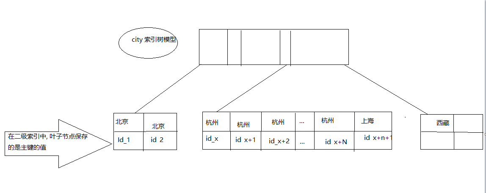

## order by 的工作方式

**需求:假设你要查询城市是“杭州”的所有人名字，并且按照姓名排序返回前 1000 个人的姓名、年龄。**

sort_buffer: MySQL 为排序开辟的内存.

创建一个新的数据表做测试;

```mysql
create table t (
`id` int primary key , 
`city` varchar(16) not null,
`age` int(11) not null, 
`addr` varchar(128) default null,
 key `city` (`city`)
)ENgine = INNODB;
```

> 其中 city 是一个普通的索引

SQL 可能会这么写

```mysql
select city, name, age from t where city = "杭州" order by name limit 1000;
```


#### 全字段排序

为了避免全表扫描, 我们需要在 city 字段中加上索引, 

现在在 city 索引树的模型如下




从图中可以看出, 满足 city = '杭州' 条件的行, 是从 ID_X 到 id(x+N) 的记录, 

通常情况下,`select city, name, age from t where city = "杭州" order by name limit 1000;` 这个语句的执行流程如下:

1. 初始化 sort_buffer, 确定放入的 name, city, age 这三个字段
2. 从索引 city 中找到第一个满足 city = '杭州' 条件的主键 id, 上图的 id_x
3. 到主键 id 索引取出整行, 取 name, city, age 三个字段的值, 存入 sort_buffer 中, 
4. 从 索引 city  取下一个记录的主键 id;
5. 重复步骤 3, 4 直到 city 的值不满足条件位置, 对应的主键 id 也就是图中的 `id(x_n+1)`;
6. 对 sort_buffer 中的数据按照字段 `name` 做快速排序
7. 按照排序的结果取前 1000 行返回给客户端

按照 name 的排序可能在内存中完成, 也可能需要外部排序, 这个取决于排序所需要的内存和参数 sort_buffer_size.

sort_buffer_size  就是 MySQL 为排序开辟的内存的大小, 如果要排序的数据量小于 sort_buffer_size, 排序就在内存中完成. 如果排序的数据量太大, 内存放不下, 则不得不利用磁盘临时文件来辅助排序.

查看是否使用了临时文件来辅助排序:

```MySQL
/* 打开optimizer_trace，只对本线程有效 */
SET optimizer_trace='enabled=on'; 
/* @a保存Innodb_rows_read的初始值 */
select VARIABLE_VALUE into @a from performance_schema.session_status where variable_name = 'Innodb_rows_read';
/* 执行语句 */
select name, age , city  from t where city='杭州' order by name limit 1000;
/* 查看 OPTIMIZER_TRACE 输出 */
SELECT * FROM `information_schema`.`OPTIMIZER_TRACE`\G
/* @b保存Innodb_rows_read的当前值 */
select VARIABLE_VALUE into @b from performance_schema.session_status where variable_name = 'Innodb_rows_read';
/* 计算Innodb_rows_read差值 */
select @b-@a;

```

搜索出的结果是: 

```json

*************************** 1. row ***************************
                            QUERY: select city, name,age from t where city='杭州' order by name limit 1000
                            TRACE: {
  "steps": [
    {
      "join_preparation": {
        "select#": 1,
        "steps": [
          {
            "expanded_query": "/* select#1 */ select `t`.`city` AS `city`,`t`.`name` AS `name`,`t`.`age` AS `age` from `t` where (`t`.`city` = '杭州') order by `t`.`name` limit 1000"
          }
        ]
      }
    },
    {
      "join_optimization": {
        "select#": 1,
        "steps": [
          {
            "condition_processing": {
              "condition": "WHERE",
              "original_condition": "(`t`.`city` = '杭州')",
              "steps": [
                {
                  "transformation": "equality_propagation",
                  "resulting_condition": "(`t`.`city` = '杭州')"
                },
                {
                  "transformation": "constant_propagation",
                  "resulting_condition": "(`t`.`city` = '杭州')"
                },
                {
                  "transformation": "trivial_condition_removal",
                  "resulting_condition": "(`t`.`city` = '杭州')"
                }
              ]
            }
          },
          {
            "substitute_generated_columns": {
            }
          },
          {
            "table_dependencies": [
              {
                "table": "`t`",
                "row_may_be_null": false,
                "map_bit": 0,
                "depends_on_map_bits": [
                ]
              }
            ]
          },
          {
            "ref_optimizer_key_uses": [
              {
                "table": "`t`",
                "field": "city",
                "equals": "'杭州'",
                "null_rejecting": false
              }
            ]
          },
          {
            "rows_estimation": [
              {
                "table": "`t`",
                "range_analysis": {
                  "table_scan": {
                    "rows": 305566,
                    "cost": 63263
                  },
                  "potential_range_indexes": [
                    {
                      "index": "PRIMARY",
                      "usable": false,
                      "cause": "not_applicable"
                    },
                    {
                      "index": "city",
                      "usable": true,
                      "key_parts": [
                        "city",
                        "id"
                      ]
                    },
                    {
                      "index": "idx_t_deleted_at",
                      "usable": false,
                      "cause": "not_applicable"
                    }
                  ],
                  "setup_range_conditions": [
                  ],
                  "group_index_range": {
                    "chosen": false,
                    "cause": "not_group_by_or_distinct"
                  },
                  "analyzing_range_alternatives": {
                    "range_scan_alternatives": [
                      {
                        "index": "city",
                        "ranges": [
                          "杭州 <= city <= 杭州"
                        ],
                        "index_dives_for_eq_ranges": true,
                        "rowid_ordered": true,
                        "using_mrr": false,
                        "index_only": false,
                        "rows": 82076,
                        "cost": 98492,
                        "chosen": false,
                        "cause": "cost"
                      }
                    ],
                    "analyzing_roworder_intersect": {
                      "usable": false,
                      "cause": "too_few_roworder_scans"
                    }
                  }
                }
              }
            ]
          },
          {
            "considered_execution_plans": [
              {
                "plan_prefix": [
                ],
                "table": "`t`",
                "best_access_path": {
                  "considered_access_paths": [
                    {
                      "access_type": "ref",
                      "index": "city",
                      "rows": 82076,
                      "cost": 22859,
                      "chosen": true
                    },
                    {
                      "rows_to_scan": 305566,
                      "access_type": "scan",
                      "resulting_rows": 82076,
                      "cost": 63261,
                      "chosen": false
                    }
                  ]
                },
                "condition_filtering_pct": 100,
                "rows_for_plan": 82076,
                "cost_for_plan": 22859,
                "chosen": true
              }
            ]
          },
          {
            "attaching_conditions_to_tables": {
              "original_condition": "(`t`.`city` = '杭州')",
              "attached_conditions_computation": [
              ],
              "attached_conditions_summary": [
                {
                  "table": "`t`",
                  "attached": null
                }
              ]
            }
          },
          {
            "clause_processing": {
              "clause": "ORDER BY",
              "original_clause": "`t`.`name`",
              "items": [
                {
                  "item": "`t`.`name`"
                }
              ],
              "resulting_clause_is_simple": true,
              "resulting_clause": "`t`.`name`"
            }
          },
          {
            "added_back_ref_condition": "((`t`.`city` <=> '杭州'))"
          },
          {
            "refine_plan": [
              {
                "table": "`t`",
                "pushed_index_condition": "(`t`.`city` <=> '杭州')",
                "table_condition_attached": null
              }
            ]
          }
        ]
      }
    },
    {
      "join_execution": {
        "select#": 1,
        "steps": [
          {
            "filesort_information": [
              {
                "direction": "asc",
                "table": "`t`",
                "field": "name"
              }
            ],
            "filesort_priority_queue_optimization": {
              "limit": 1000,
              "rows_estimate": 1592226,
              "row_size": 515,
              "memory_available": 262144
            },
            "filesort_execution": [
            ],
            "filesort_summary": {
              "rows": 43733,
              "examined_rows": 43733,
              "number_of_tmp_files": 88,
              "sort_buffer_size": 262024,
              "sort_mode": "<sort_key, rowid>"
            }
          }
        ]
      }
    }
  ]
}
MISSING_BYTES_BEYOND_MAX_MEM_SIZE: 0
          INSUFFICIENT_PRIVILEGES: 0
1 row in set (0.00 sec)

```

**number_of_tmp_files** 表示的意思就是在排序的过程使用临时文件数. 这里是的数值是 **88**, 为什么需要这么多个文件呢? **当内存放不下时**, 需要使用外部排序, 外部排序一般使用的是归并的排序算法. **可以这么理解:** MySQL 将需要排序的数据分成 88 份, 每一份单独排序后保存在这些临时文件中, 然后把这 88 个有序文件再次合并成一个有序的大文件.

如果 sort_buffer_size 超过了需要排序数据量的大小, number_of_tmp_files 就是 0, 表示可以排序可以直接在内存中完成. 

否则就需要在临时文件中排序, sort_buffer_size 越小, 需要分成的分数就越多, number_of_tmp_files 的值就越大. 

**examined_rows**:  表示参与排序的行数有 43733.

**sort_mode** 表示使用 row_id 排序


#### rowid 排序

1. 初始化 sort_buffer, 确定放入的 name, city, age 这三个字段
2. 从索引 city 中找到第一个满足 city = '杭州' 条件的主键 id, 上图的 id_x
3. 到主键 id 索引取出整行, 取 name, city, age 三个字段的值, 存入 sort_buffer 中, 
4. 从 索引 city  取下一个记录的主键 id;
5. 重复步骤 3, 4 直到 city 的值不满足条件位置, 对应的主键 id 也就是图中的 `id(x_n+1)`;
6. 对 sort_buffer 中的数据按照字段 `name` 做快速排序
7. 按照排序的结果取前 1000 行, 并按照 id 的值回到原表中取出 city, name, 和 age 三个字段爹返回给客户端


#### 全字段排序和 rowid 排序

如果 MySQL 实在是担心排序的内存太小, 会影响排序效率, 才会使用 rowid 排序算法, 这样的过程中一次可以排序多行, 但是需要回到原表中读取数据. 

如果 MySQL 认为内存足够大, 会优先选择全字段排序, 把需要的字段都放到 sort_buffer 中, 这样排序后就会直接从内存中返回查询的结果了, 不用再回到原表中取数据了. 

: **如果内存足够, 就要多利用内存, 尽量减少磁盘的访问**

对于 InnoDB 表来说, rowid 排序会要求回表多造成磁盘读, 因此不被优先选择. 

**并不是所有的 order by 语句都是需要进行排序操作的**

**如果对应的数据从数据表中取出来时, 就是有序的话**, 那就不用再次做排序了

