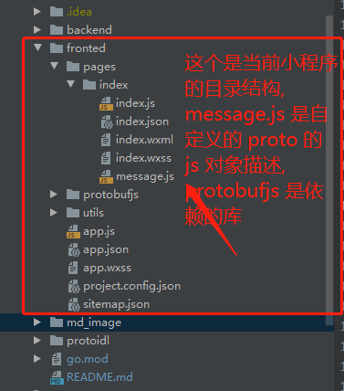

# 小程序使用 protobuff 

**小程序屏蔽了 google 提供 proto2js 库的某些操作, 然后世界上最大的悲剧发生了 /(ㄒoㄒ)/~~**

**长文警告**

> 目录结构如下:
* [小程序目录](./fronted) ~~ps: 用的是测试号~~
* [proto buff 结构定义](./protoidl) protoc 文件引入路径: **[protoc 路径填坑指北](https://github.com/ciison/0x3f3f3f3f/blob/master/protoc/protoc%20%E8%B7%AF%E5%BE%84%E8%A1%A5%E5%9D%91%E6%8C%87%E5%8D%97.md)**
* [后端数据交互 go version](./backend)


## 安装 proto 转 js 的工具

必要的依赖库: [ https://github.com/protobufjs/protobuf.js ]( https://github.com/protobufjs/protobuf.js ) 

主要引用的文件:  [  https://github.com/protobufjs/protobuf.js/tree/master/src ]( https://github.com/protobufjs/protobuf.js/tree/master/src )

pbjs 状态图：


> 命令中的 -g 选项表示全局安装

```shell
npm install -g protobufjs
```
> ps: 如果 npm 安装失败，试试国内镜像， 比如万能的淘宝 `npm config set registry https://registry.npm.taobao.org `


工具完成之后, 选择 `pbjs --h` 命令大法


编写一份简单 proto 文件, 命名为 message.proto, 描述如下: 
```proto
syntax = "proto3";

// 定义一个 "类" AMiniResponse :: 这个会名称之后会用到的
message AMiniResponse {
    string open_id = 1;
    string jwt = 2;
    string address = 3;
    int64 age = 4; //不要问为什么是 int64, 或许是没有猿都希望自己活得长一点
}

// post 请求用的
message AMiniPostRequest {
    string jwt = 1;
    string category = 2;
}

message AMiniPostResponse {
    int32 err_code = 1;
    string err_message = 2;
    repeated string category = 3; // category 数组
}

```

生成的 json 描述文件, 默认执行这个命令时, 你的路径来到了 `message.proto` 所在的文件夹 

```shell 
pbjs -t json -p . message.proto > message.json
```
将生成的 json 文件使用 es6 的语法, 将对象导出, 命名为 `message.js`(名字可以随便起, 后缀为 `.js` 即可), 这个是给 protobuffjs 库使用的
导出的文件内容如下:
```js
// 导出定义的信息
module.exports = {
    "nested": {
        "AMiniResponse": {
            "fields": {
                "openId": {
                    "type": "string",
                    "id": 1
                },
                "jwt": {
                    "type": "string",
                    "id": 2
                },
                "address": {
                    "type": "string",
                    "id": 3
                },
                "age": {
                    "type": "int64",
                    "id": 4
                }
            }
        },
        "AMiniPostRequest": {
            "fields": {
                "jwt": {
                    "type": "string",
                    "id": 1
                },
                "category": {
                    "type": "string",
                    "id": 2
                }
            }
        },
        "AMiniPostResponse": {
            "fields": {
                "errCode": {
                    "type": "int32",
                    "id": 1
                },
                "errMessage": {
                    "type": "string",
                    "id": 2
                },
                "category": {
                    "rule": "repeated",
                    "type": "string",
                    "id": 3
                }
            }
        }
    }
}
```

小程序: 需要 `message.js` 引入到项目, 小程序的目录结构如下: 




小程序的 `index.js`, 文件描述如下, 简单起见, 生命周期回调都删除

```javascript
//index.js
//获取应用实例
const app = getApp()
const BaseUrl = "http://localhost:8080"
console.log(BaseUrl)
let protoBuff = require('../../protobufjs/protobuf') // 引入 protoBuff 的库
let messageConfig = require('./message')
let messageRoot = protoBuff.Root.fromJSON(messageConfig)
console.log(messageRoot)
// proto 定义的类型， 这里的类型没有 package 定义这个 proto 文件时没有写上 package 名称;
let AMiniResponse = messageRoot.lookupType('AMiniResponse')
console.log(AMiniResponse)
let AMiniPostRequest = messageRoot.lookupType('AMiniPostRequest')
console.log(AMiniPostRequest)
let AMiniPostResponse = messageRoot.lookupType('AMiniPostResponse')
console.log(AMiniPostResponse)

function Uint8ArrayToString(fileData) {
  let dataString = "";
  for (let i = 0; i < fileData.length; i++) {
    dataString += String.fromCharCode(fileData[i]);
  }
  return dataString
}

function StringToUint8Array(str) {
  let arr = [];
  for (let i = 0, j = str.length; i < j; ++i) {
    arr.push(str.charCodeAt(i));
  }
  let tmpUint8Array = new Uint8Array(arr);
  return tmpUint8Array
}
Page({
  data: {
    aMiniPostResponse:{},
    aMiniPostRequest:{},
    aMiniResponse:{}
  },

  onLoad: function () {},
  getQeury(evt) {
    //console.log(evt)
    wx.request({
      url: BaseUrl + '/query',
      method: 'GET',
      success: (res) => {
        console.log(res);
        let buffer = StringToUint8Array(res.data)
        console.log(buffer)
        let rb = AMiniResponse.decode(buffer)
        console.log(rb)
      }
    })
  },
  postQuery(evt) {
    //console.log(evt);
    wx.request({
      url: BaseUrl + '/query',
      method: 'POST',
      success: (res) => {
        console.log(res)
        let data = StringToUint8Array(res.data)
        let a = AMiniPostResponse.decode(data)
        console.log(a)
        this.setData({
          aMiniPostResponse:a,
        })
        // console.log(data)
      }
    })
  }

})
```


后端 (go版本) 返回的是 protobuff 描述

```go
package main

import (
	"crypto/md5"
	"encoding/base64"
	"fmt"
	"io/ioutil"
	"math"
	"math/rand"
	"net/http"
	"time"

	message "0x3f3f3f3f/pbjs_lizi/protoidl"
	"github.com/gin-gonic/gin"
	"github.com/golang/protobuf/proto"
)

func main() {

	engine := gin.Default()
	// 跨域处理
	engine.Use(func(ctx *gin.Context) {
		method := ctx.Request.Method
		ctx.Header("Access-Control-Allow-Origin", "*")
		ctx.Header("Access-Control-Allow-Headers", "Content-Type,AccessToken,X-CSRF-Token, Authorization, Token")
		ctx.Header("Access-Control-Allow-Methods", "POST, GET, OPTIONS")
		ctx.Header("Access-Control-Expose-Headers", "Content-Length, Access-Control-Allow-Origin, Access-Control-Allow-Headers, Content-Type")
		ctx.Header("Access-Control-Allow-Credentials", "true")
		if method == "OPTIONS" {
			ctx.AbortWithStatus(http.StatusNoContent)
			return
		}
		ctx.Next()
	})

	engine.GET("/query", func(ctx *gin.Context) {
		var resp message.AMiniResponse
		h := md5.New()
		h.Write([]byte(time.Now().Format(time.ANSIC)))                                    // 随便写入点什么东西， 反正我也看不懂
		resp.Age = math.MaxInt64                                                          // 最大的 int64
		resp.Jwt = base64.StdEncoding.EncodeToString(h.Sum(nil))                          // 这里我是乱描述的， 是那个意思就好
		resp.Age = 18                                                                     // 心理年龄永远是年轻的
		resp.OpenId = "init_heap; init_start_up_men;load_main_fn; println('hello world')" // 初始化堆, 加载 main, 第一句永远是 hello world
		resp.Address = "on my way"                                                        // 地址是伪造的， 据说这样可以。。。
		fmt.Printf("AMiniResponse%#v\n", resp.String())
		ctx.ProtoBuf(http.StatusOK, &resp) // 使用 pb 的方式返回数据
	})

	engine.POST("/query", func(ctx *gin.Context) {
		var req message.AMiniPostRequest
		var resp message.AMiniPostResponse
		defer ctx.Request.Body.Close()
		data, err := ioutil.ReadAll(ctx.Request.Body)
		if err != nil {
			fmt.Printf("[error] ioutil.ReadAll error:%s\n", err)
			resp.ErrCode = 500
			resp.ErrMessage = "internal error"
			ctx.ProtoBuf(http.StatusOK, &resp)
			return
		}

		if err = proto.Unmarshal(data, &req); err != nil {
			fmt.Printf("[error] proto.UnmarshalMerge error:%s\n", err)
			resp.ErrCode = 400
			resp.ErrMessage = "bad params"
			ctx.ProtoBuf(http.StatusOK, &resp)
			return
		}
		resp.ErrCode = 1
		resp.ErrMessage = "success"
		for i := 0; i < rand.Intn(20); i++ {
			resp.Category = append(resp.Category, string('Z'-rand.Intn(20)))
		}
		fmt.Printf("resp:%s\n", resp.String())
		ctx.ProtoBuf(http.StatusOK, &resp)
	})

	if err := engine.Run("0.0.0.0:8080"); err != nil {
		panic(err)
	}
}

```


## 使用嵌套定义 proto


proto 文件的定义: [err_info.proto](./protoidl/err/err_info.proto), [err_report.proto](./protoidl/err/err_report.proto)

**编译 go 文件需要注意 proto文件的路径, [proto 文件路径填坑指北](https://github.com/ciison/0x3f3f3f3f/blob/master/protoc/protoc%20%E8%B7%AF%E5%BE%84%E8%A1%A5%E5%9D%91%E6%8C%87%E5%8D%97.md)**

现在我们只需要: err_report.proto 生成 JSON 格式的描述, 当前的路径是在 err_report.proto 所在的文件夹下

```shell
pbjs -t json -p . err_report.proto > err_report.json
```

同样将, `err_report.json` 作为 js 对象导出, 文件命名暂定为  `err_report.js`, 然后将 `err_report.js` 拷贝到小程序项目目录下, 在小程序的 `index.js` 中增加类型的引入

> 将新定义的类型引入

```javascript
let errReportConfig = require('./err_report')
let errReportRoot = protoBuff.Root.fromJSON(errReportConfig)

let errReportRequestType = errReportRoot.lookupType('err.ErrReportRequest')
let errReportErrInfoType = errReportRoot.lookupType('err.ErrInfo')
let errReportResponseType = errReportRoot.lookupType('err.ErrReportResponse')
let serverInfoType = errReportRoot.lookupType('err.ServerInfo')
```


发起一个复杂的请求

```javascript
 postComplex(evt) {
        let pageUrl = '/index/index'
        let appId = '12345'
        let errInfo = {
            pageUrl,
            appId,
            errInfo: 'userClickPage',
        }
        let accessToken = 'jsx'
        let message = {
            errInfo,
            accessToken,
        }
        console.log(message)
        let buffer = errReportRequestType.encode(message).finish()
        let str = Uint8ArrayToString(buffer)
        wx.request({
            url: BaseUrl + '/complex/err',
            method: 'POST',
            header: {
                'content-type': 'text/plaintext'
            },
            data: str,
            success: (res) => {
                console.log(res)
                let data = StringToUint8Array(res.data)
                let errReportResponse = errReportResponseType.decode(data)
                console.log(errReportResponse)
                let errCode = errReportResponse.errCode
                let errMessage = errReportResponse.errMessage
                let serverInfo = errReportResponse.serverInfo
                let msg = {
                    errCode,
                    errMessage,
                    serverInfo,
                }
                this.setData({
                    errReportResponse: msg
                })
            }
        })
    }
```

> 别问为什么不用 promise, 问就菜( ╯□╰ ), ~~ ~~例子当然是越简单越好阿~~


后端加入响应数据: 

```go
engine.POST("/complex/err", func(ctx *gin.Context) {
		fmt.Printf("[info] query:%s\n", ctx.Request.RequestURI)
		var req report.ErrReportRequest
		var resp report.ErrReportResponse
		defer ctx.Request.Body.Close()
		data, err := ioutil.ReadAll(ctx.Request.Body)
		if err != nil {
			fmt.Printf("[error] ioutil.ReadAll error:%s\n", err)
			resp.ErrCode = 500
			resp.ErrMessage = "internal error"
			ctx.ProtoBuf(http.StatusOK, &resp)
			return
		}
		if err = proto.Unmarshal(data, &req); err != nil {
			fmt.Printf("[error] proto.Unmarshal error:%s\n", err)
			resp.ErrCode = 400
			resp.ErrMessage = "bad params"
			ctx.ProtoBuf(http.StatusOK, &resp)
			return
		}
		fmt.Printf("[info] query data:%s, %#v\n", req.String(),req )
		
		resp.ErrCode = 1
		resp.ErrMessage = "success"
		resp.ServerInfo = &report.ServerInfo{Version:strconv.FormatInt(rand.Int63(), 10)+ "::: build by golang, complex struct, "+ time.Now().Format("2006-01-02 15:04:05")}
		fmt.Printf("resp:%s\n", resp.String())
		ctx.ProtoBuf(http.StatusOK, &resp)
	})
```


到这里, 小程序上使用 protobuffer 与服务器的交互~~(简单的, 嵌套的都有了)~~就这么多了, 接下来就是要结合业务自己玩了

[查看完整的例子]( https://github.com/ciison/0x3f3f3f3f/tree/master/pbjs_lizi )