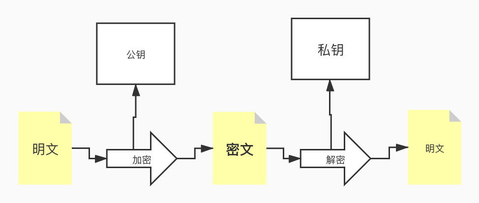

# 非对称加密
> 公开秘钥加密算法, **公钥加密**

公钥加密， 需要两个秘钥， 一个是公开的秘钥， 一个是私有的秘钥， 一个用作加密， 一个用作解
* 使用其中一个把明文加密之后得到密文， 只能用相对应的另外一个秘钥才能解密得到对应的明文， **甚至最初的加密的秘钥也不能用来解密得到最初的明文**
* 由于加密和解密需要不同的秘钥， 所以叫做非对称加密， 如果知道了其中的一个， 并不能拼接此来计算另外一个， 因此其中的一个可以公开称为公钥， 不能公开的秘钥称为私钥， 必须由用户自行严格保存， 不能向外透露
* **公钥加密， 私钥解密的过程叫做非对称加密解密的过程**
* 如果是私钥加密， 公钥解密的过程， 那么叫做 **数字签名和验证签名的过程**

总结: 公钥的作用 加密消息和验证签名
    私钥的作用： 解密消息和进行数字签名
    

RSA 和椭圆曲线算法 Ecc     