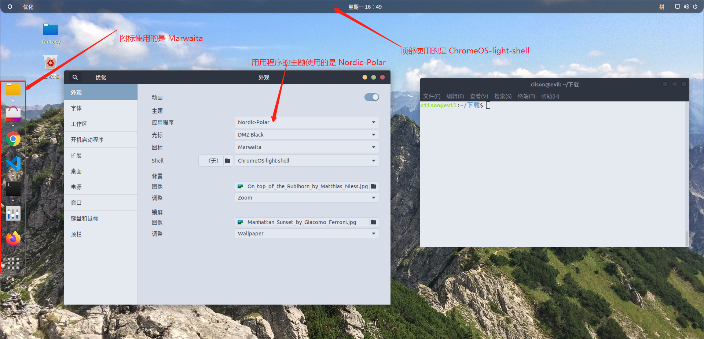
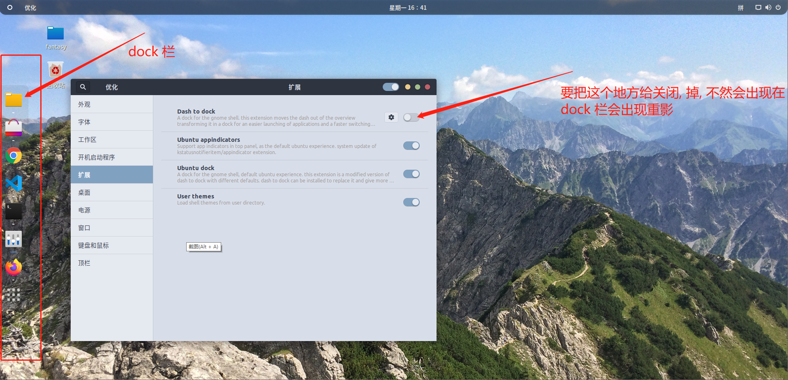

#  ## linux 美化

**warning**: **本持着颜值和简洁就是第一生产力才折腾了**

> 目标系统为 `ubuntu 18.04 LTS` ,  
>
> 如何查看 : `uname -a`

#### 美化的效果如下

* 安装 tweak-tool

  > 终端执行 ` sudo apt-get install unity-tweak-tool `

* 在浏览器上安装 `gnome-extensions`

* 安装 tweak-tool 的插件

  *  [gnome-extension插件的地址](https://extensions.gnome.org)
  * [gnome 图标和主题](https://www.gnome-look.org) , 将图标解压后放在 `/usr/share/icons/` , 主题解压后放在 `/usr/share/themes/` 
  * [Nordic](https://www.pling.com/s/Gnome/p/1267246/) 应用程序 theme
  * [[ChromeOS shell theme](https://www.pling.com/s/Gnome/p/1333760/)] 顶部 shell 的 样式
  * [ Marwaita]( https://www.pling.com/s/Gnome/p/1270110/ )  应用程序 icon

#### bug ? 

**需要在 tweak tool 工具的拓展栏, 把 Dash to dock 的选项给取消掉**, 如果没有取消, dock 栏会出现重影的情况

#### 拓展 

* 安装 albert 
  * 添加 albert 的软件源 ` sudo add-apt-repository ppa:noobslab/macbuntu `
  * 更新本机的软件源信息 `sudo apt-get update`
  * 下载安装 albert `sudo apt-get install albert`
  * 开启 albert 
  * 最重要的一步, 好好地使用 `albert` 
